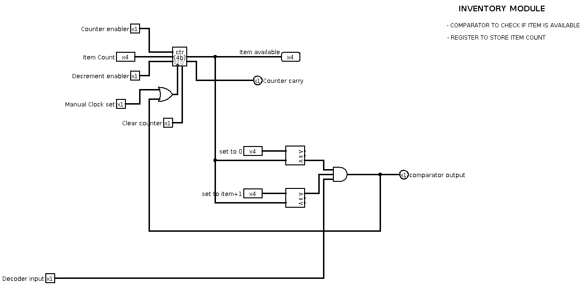

# DineFlow- Smart Automatic Order Management System For Restaurants

<!-- First Section -->
## Team Details
  <details>
  <summary> Details  </summary>
    
**Semester:** 3rd Sem B. Tech. CSE

**Section:** S1

**Team Number:** 5

**Member 1:** Rakshith Ashok Kumar, 231CS147, [rakshithashok.231cs147@nitk.edu.in](mailto:rakshithashok.231cs147@nitk.edu.in)

**Member 2:** Utsav Singh Bhamra, 231CS161, [utsavbhamra.231cs161@nitk.edu.in](mailto:utsavbhamra.231cs161@nitk.edu.in)

**Member 3:** Akshaj PVY, 231CS109, [akshajvenkatayathirajapolisetty.231cs109@nitk.edu.in](mailto:akshajvenkatayathirajapolisetty.231cs109@nitk.edu.in)

</details>

<!-- Second Section -->
## Abstract
  <details>
  <summary>Details</summary>

#### Motivation -

Our team had gone to the night canteen in NITK and placed an order. We had to wait in a large queue because orders were being written manually, and the bill was calculated on pen and paper. Also, the person who was taking orders did not know which items were available for service.

These instances are a common occurrence, and it prompted us to pursue this project.

#### Problem Statement -

In small restaurants and remote towns, ordering and bill calculation is done manually, resulting in delays and inefficiency. In order to eliminate these inefficiencies, we require a restaurant management system that processes orders, tracks inventory, and calculates bills automatically.

#### Features -

- Binary encoded switches for menu selection.
- Uses a 4-bit shift register to store multiple orders in a queue.
- Employs a 4-bit counter to track the time it takes to prepare an order.
- Utilises registers to store the prices of menu items.
- Checks item availability status using sequential counters.

</details>


<!-- Third Section -->

## Block Diagram
<details>
  <summary> Details </summary>

<p align="center"></p>
<p align="center"> <em> Block Diagram for the logic of order management </em> </p>
  <br>  
  <br>  
</details>

<!-- Fourth Section -->
## Working 
<details>
  <summary>  Details  </summary>

The restaurant management system takes order inputs from two
tables. Initially, it checks the inventory to ensure availability of these items. The inventory module is implemented with the help of a counter
which keeps track of the current stock, and a 4-bit comparator, which
checks whether stock is greater than the quantity of item ordered.

The queue module is used to ensure that the items are served in
the same sequence that the order is placed. The order queue with shift
registers is implemented with D flip-flops.

The timer module is used to track the order time. It is implemented
with the help of a clock, down counter, and a comparator. When the
down counter reaches 0, the comparator detects it and pushes the order
for service.

Finally, the billing module is used to calculate the total bill. The
price of each item is added to the bill as and when it is ordered, and
the module is implemented using 4-bit adders.

The final output truth table highlights the total bill for each table
as well as the total time taken. It also displays the availability of items in the inventory at each stage.

#### Instructions-

1) Enable the multiplexer and decoder and set the table number in the multiplexer.
2) Enable all the inventory modules corresponding to each item in the menu.
3) Set the item count input in each inventory module to the number of items available.
4) Set the 4-bit comparator input to item count to (count+1) and then enable decrement in all inventory module.
5) Enable the timer module and set the time taken for each item through the 4 bit inputs.
6) Run the clocks once your order is ready and in the queue to receive bill.

#### Flowchart - 

<p align="center"></p>
<p align="center"> <em> Logic of order management </em> </p>

#### Functional Table- 

<p align="center"></p>

#### Explanation of Test Case - 

In the example shown, items are ordered for Table 0 and Table 1 simultaneously. As items are being ordered, they are being displayed after the timer lapses, and the bill is updated, We can  also see how the last two items are rejected as they are out of stock in the inventory. The total time taken and bill for each table is displayed.

</details>

<!-- Fifth Section -->
## Logisim Circuit Diagram
<details>
  <summary> Details  </summary><br>
    <p align="center"></p>
    <p align="center"> <em>Fig. 1: Main circuit </em> </p><br><br>
    <p align="center"></p>
    <p align="center"> <em>Fig. 2: Inventory module </em> </p><br><br>
    <p align="center"></p>
    <p align="center"> <em>Fig. 3: Timer module </em> </p><br><br>
    <p align="center"></p>
    <p align="center"> <em>Fig. 4: Order Queue module </em> </p><br><br>
    <p align="center"></p>
    <p align="center"> <em>Fig. 5: Billing module </em> </p>

</details>

<!-- Sixth Section -->
## Verilog Code

<details>
<summary>Gate Model</summary>

```
module restaurant_management_system (
    input clk,
    input reset,
    input [1:0] table0_order_item,
    input table0_order_valid,
    input [1:0] table1_order_item,
    input table1_order_valid,
    output reg [7:0] table0_bill,
    output reg [7:0] table1_bill,
    output table0_order_reject,
    output table1_order_reject,
    output reg [3:0] table0_queue_size,
    output reg [3:0] table1_queue_size,
    output reg [1:0] table0_ready_item,
    output reg [1:0] table1_ready_item,
    output reg table0_item_ready,
    output reg table1_item_ready
);

    // Parameters
    parameter NUM_ITEMS = 4; // Items 0 to 3
    parameter QUEUE_SIZE = 16;

    // Inventory
    reg [3:0] inventory [0:NUM_ITEMS-1];

    // Menu prices and preparation times
    reg [7:0] item_prices [0:NUM_ITEMS-1];
    reg [7:0] item_prep_times [0:NUM_ITEMS-1];

    // Order queues
    reg [1:0] table0_queue [0:QUEUE_SIZE-1];
    reg [1:0] table1_queue [0:QUEUE_SIZE-1];
    reg [3:0] table0_queue_head, table0_queue_tail;
    reg [3:0] table1_queue_head, table1_queue_tail;

    // Timers
    reg [7:0] table0_timer, table1_timer;

    integer i;

    // Initialize inventory, prices, and prep times
    initial begin
        for (i = 0; i < NUM_ITEMS; i = i + 1) begin
            inventory[i] = 5;
            item_prices[i] = i+2; // Prices set to 0,1,2,3
            item_prep_times[i] = i+1; // Preparation times set to 0,1,2,3
        end
    end

    // Gate-level representation of order rejection logic for Table 0
    wire [3:0] inventory_item0;
    wire inventory_empty0, queue_full0;

    assign inventory_item0 = inventory[table0_order_item];

    nor nor_inv_empty0(inventory_empty0, inventory_item0[0], inventory_item0[1], inventory_item0[2], inventory_item0[3]);
    and and_queue_full0(queue_full0, table0_queue_size[0], table0_queue_size[1], table0_queue_size[2], table0_queue_size[3]);

    wire reject_condition0;
    or or_reject_cond0(reject_condition0, inventory_empty0, queue_full0);
    and and_reject0(table0_order_reject, table0_order_valid, reject_condition0);

    // Gate-level representation of order rejection logic for Table 1
    wire [3:0] inventory_item1;
    wire inventory_empty1, queue_full1;

    assign inventory_item1 = inventory[table1_order_item];

    nor nor_inv_empty1(inventory_empty1, inventory_item1[0], inventory_item1[1], inventory_item1[2], inventory_item1[3]);
    and and_queue_full1(queue_full1, table1_queue_size[0], table1_queue_size[1], table1_queue_size[2], table1_queue_size[3]);

    wire reject_condition1;
    or or_reject_cond1(reject_condition1, inventory_empty1, queue_full1);
    and and_reject1(table1_order_reject, table1_order_valid, reject_condition1);

    always @(posedge clk or posedge reset) begin
        if (reset) begin
            // Reset all registers
            table0_bill <= 0;
            table1_bill <= 0;
            table0_queue_size <= 0;
            table1_queue_size <= 0;
            table0_ready_item <= 0;
            table1_ready_item <= 0;
            table0_item_ready <= 0;
            table1_item_ready <= 0;
            table0_queue_head <= 0;
            table0_queue_tail <= 0;
            table1_queue_head <= 0;
            table1_queue_tail <= 0;
            table0_timer <= 0;
            table1_timer <= 0;

            for (i = 0; i < NUM_ITEMS; i = i + 1) begin
                inventory[i] <= 5;
            end
        end else begin
            // Handle orders for Table 0
            if (table0_order_valid && !table0_order_reject) begin
                inventory[table0_order_item] <= inventory[table0_order_item] - 1;
                table0_queue[table0_queue_tail] <= table0_order_item;
                table0_queue_tail <= (table0_queue_tail + 1) % QUEUE_SIZE;
                table0_queue_size <= table0_queue_size + 1;
                table0_bill <= table0_bill + item_prices[table0_order_item];
            end

            // Handle orders for Table 1
            if (table1_order_valid && !table1_order_reject) begin
                inventory[table1_order_item] <= inventory[table1_order_item] - 1;
                table1_queue[table1_queue_tail] <= table1_order_item;
                table1_queue_tail <= (table1_queue_tail + 1) % QUEUE_SIZE;
                table1_queue_size <= table1_queue_size + 1;
                table1_bill <= table1_bill + item_prices[table1_order_item];
            end

            // Handle timers and item readiness for Table 0
            if (table0_queue_size > 0) begin
                if (table0_timer == 0) begin
                    table0_timer <= item_prep_times[table0_queue[table0_queue_head]];
                end else if (table0_timer == 1) begin
                    table0_ready_item <= table0_queue[table0_queue_head];
                    table0_item_ready <= 1;
                    table0_queue_head <= (table0_queue_head + 1) % QUEUE_SIZE;
                    table0_queue_size <= table0_queue_size - 1;
                    table0_timer <= 0;
                end else begin
                    table0_timer <= table0_timer - 1;
                    table0_item_ready <= 0;
                end
            end else begin
                table0_item_ready <= 0;
            end

            // Handle timers and item readiness for Table 1
            if (table1_queue_size > 0) begin
                if (table1_timer == 0) begin
                    table1_timer <= item_prep_times[table1_queue[table1_queue_head]];
                end else if (table1_timer == 1) begin
                    table1_ready_item <= table1_queue[table1_queue_head];
                    table1_item_ready <= 1;
                    table1_queue_head <= (table1_queue_head + 1) % QUEUE_SIZE;
                    table1_queue_size <= table1_queue_size - 1;
                    table1_timer <= 0;
                end else begin
                    table1_timer <= table1_timer - 1;
                    table1_item_ready <= 0;
                end
            end else begin
                table1_item_ready <= 0;
            end
        end
    end

endmodule
```
</details>

<details>
  <summary> Behavioural model </summary>

```
 module restaurant_management_system (
     input clk,
     input reset,
     input [1:0] table0_order_item, // 2-bit order items
     input table0_order_valid,
     input [1:0] table1_order_item, // 2-bit order items
     input table1_order_valid,
     output reg [7:0] table0_bill,
     output reg [7:0] table1_bill,
     output reg table0_order_reject,
     output reg table1_order_reject,
     output reg [3:0] table0_queue_size,
     output reg [3:0] table1_queue_size,
     output reg [1:0] table0_ready_item, // 2-bit ready items
     output reg [1:0] table1_ready_item, // 2-bit ready items
     output reg table0_item_ready,
     output reg table1_item_ready
 );

   // Parameters
   parameter NUM_ITEMS = 4; // Items 0 to 3
   parameter QUEUE_SIZE = 16;

   // Inventory
   reg [3:0] inventory [0:NUM_ITEMS-1];

   // Menu prices and preparation times
   reg [7:0] item_prices [0:NUM_ITEMS-1];
   reg [7:0] item_prep_times [0:NUM_ITEMS-1];

   // Order queues
   reg [1:0] table0_queue [0:QUEUE_SIZE-1]; // 2-bit order items
   reg [1:0] table1_queue [0:QUEUE_SIZE-1]; // 2-bit order items
   reg [3:0] table0_queue_head, table0_queue_tail;
   reg [3:0] table1_queue_head, table1_queue_tail;

   // Timers
   reg [7:0] table0_timer, table1_timer;

   integer i;

   // Initialize inventory, prices, and prep times
   initial begin
       for (i = 0; i < NUM_ITEMS; i = i + 1) begin
           inventory[i] = 5;
           item_prices[i] = i; // Prices set to 0,1,2,3
           item_prep_times[i] = i; // Preparation times set to 0,1,2,3
       end
   end

   always @(posedge clk or posedge reset) begin
       if (reset) begin
           // Reset all registers
           table0_bill <= 0;
           table1_bill <= 0;
           table0_order_reject <= 0;
           table1_order_reject <= 0;
           table0_queue_size <= 0;
           table1_queue_size <= 0;
           table0_ready_item <= 0;
           table1_ready_item <= 0;
           table0_item_ready <= 0;
           table1_item_ready <= 0;
           table0_queue_head <= 0;
           table0_queue_tail <= 0;
           table1_queue_head <= 0;
           table1_queue_tail <= 0;
           table0_timer <= 0;
           table1_timer <= 0;

           for (i = 0; i < NUM_ITEMS; i = i + 1) begin
               inventory[i] <= 5;
           end
       end else begin
           // Handle orders for Table 0
           if (table0_order_valid) begin
               if (inventory[table0_order_item] > 0 && table0_queue_size < QUEUE_SIZE) begin
                   inventory[table0_order_item] <= inventory[table0_order_item] - 1;
                   table0_queue[table0_queue_tail] <= table0_order_item;
                   table0_queue_tail <= (table0_queue_tail + 1) % QUEUE_SIZE;
                   table0_queue_size <= table0_queue_size + 1;
                   table0_bill <= table0_bill + item_prices[table0_order_item];
                   table0_order_reject <= 0;
               end else begin
                   table0_order_reject <= 1;
               end
           end else begin
               table0_order_reject <= 0;
           end

           // Handle orders for Table 1
           if (table1_order_valid) begin
               if (inventory[table1_order_item] > 0 && table1_queue_size < QUEUE_SIZE) begin
                   inventory[table1_order_item] <= inventory[table1_order_item] - 1;
                   table1_queue[table1_queue_tail] <= table1_order_item;
                   table1_queue_tail <= (table1_queue_tail + 1) % QUEUE_SIZE;
                   table1_queue_size <= table1_queue_size + 1;
                   table1_bill <= table1_bill + item_prices[table1_order_item];
                   table1_order_reject <= 0;
               end else begin
                   table1_order_reject <= 1;
               end
           end else begin
               table1_order_reject <= 0;
           end

           // Handle timers and item readiness for Table 0
           if (table0_queue_size > 0) begin
               if (table0_timer == 0) begin
                   table0_timer <= item_prep_times[table0_queue[table0_queue_head]];
               end else if (table0_timer == 1) begin
                   table0_ready_item <= table0_queue[table0_queue_head];
                   table0_item_ready <= 1;
                   table0_queue_head <= (table0_queue_head + 1) % QUEUE_SIZE;
                   table0_queue_size <= table0_queue_size - 1;
                   table0_timer <= 0;
               end else begin
                   table0_timer <= table0_timer - 1;
                   table0_item_ready <= 0;
               end
           end else begin
               table0_item_ready <= 0;
           end

           // Handle timers and item readiness for Table 1
           if (table1_queue_size > 0) begin
               if (table1_timer == 0) begin
                   table1_timer <= item_prep_times[table1_queue[table1_queue_head]];
               end else if (table1_timer == 1) begin
                   table1_ready_item <= table1_queue[table1_queue_head];
                   table1_item_ready <= 1;
                   table1_queue_head <= (table1_queue_head + 1) % QUEUE_SIZE;
                   table1_queue_size <= table1_queue_size - 1;
                   table1_timer <= 0;
               end else begin
                   table1_timer <= table1_timer - 1;
                   table1_item_ready <= 0;
               end
           end else begin
               table1_item_ready <= 0;
           end
       end
   end

endmodule

```
</details>

<details>

<summary>Test Bench</summary>
  
```
module restaurant_management_system_tb;

    // Inputs
    reg clk;
    reg reset;
    reg [1:0] table0_order_item; // 2-bit order items
    reg table0_order_valid;
    reg [1:0] table1_order_item; // 2-bit order items
    reg table1_order_valid;

    // Outputs
    wire [7:0] table0_bill;
    wire [7:0] table1_bill;
    wire table0_order_reject;
    wire table1_order_reject;
    wire [3:0] table0_queue_size;
    wire [3:0] table1_queue_size;
    wire [1:0] table0_ready_item; // 2-bit ready items
    wire [1:0] table1_ready_item; // 2-bit ready items
    wire table0_item_ready;
    wire table1_item_ready;

    // Instantiate the Unit Under Test (UUT)
    restaurant_management_system uut (
        .clk(clk), 
        .reset(reset), 
        .table0_order_item(table0_order_item), 
        .table0_order_valid(table0_order_valid), 
        .table1_order_item(table1_order_item), 
        .table1_order_valid(table1_order_valid), 
        .table0_bill(table0_bill), 
        .table1_bill(table1_bill), 
        .table0_order_reject(table0_order_reject), 
        .table1_order_reject(table1_order_reject), 
        .table0_queue_size(table0_queue_size), 
        .table1_queue_size(table1_queue_size), 
        .table0_ready_item(table0_ready_item), 
        .table1_ready_item(table1_ready_item), 
        .table0_item_ready(table0_item_ready), 
        .table1_item_ready(table1_item_ready)
    );

    // Clock generation
    initial begin
        clk = 0;
        forever #5 clk = ~clk; // 10 time units period
    end

    // Test procedure
    initial begin
        // Initialize Inputs
        reset = 1;
        table0_order_item = 0;
        table0_order_valid = 0;
        table1_order_item = 0;
        table1_order_valid = 0;

        // Wait 100 ns for global reset to finish
        #100;
        reset = 0;

        // Test Case 1: Table 0 orders item 2
        #10 table0_order_item = 2;
        #10 table0_order_valid = 1;
        #10 table0_order_valid = 0;

        // Test Case 2: Table 1 orders item 3
        #20 table1_order_item = 3;
        #10 table1_order_valid = 1;
        #10 table1_order_valid = 0;

        // Test Case 3: Table 0 orders item 2 again
        #20 table0_order_item = 2;
        #10 table0_order_valid = 1;
        #10 table0_order_valid = 0;

        // Test Case 4: Table 1 orders item 0 six times, the sixth should be rejected due to inventory
        repeat (6) begin
            #20 table1_order_item = 0;
            #10 table1_order_valid = 1;
            #10 table1_order_valid = 0;
        end

        // Wait for items to be ready
        #500;

        // Test Case 5: Table 0 orders multiple items to fill queue
        repeat (16) begin
            #20 table0_order_item = $random % 4; // Ensure only 2-bit orders (0-3)
            #10 table0_order_valid = 1;
            #10 table0_order_valid = 0;
        end

        // Test Case 6: Table 0 tries to order when queue is full (should be rejected)
        #20 table0_order_item = 1;
        #10 table0_order_valid = 1;
        #10 table0_order_valid = 0;

        // Wait for simulation to finish
        #1000;
        $finish;
    end

    // Monitor
    initial begin
        $monitor("Time=%t | Table0: Item=%b, Valid=%b, Reject=%b, Bill=%d, QSize=%d, Ready=%b, ReadyItem=%b | Table1: Item=%b, Valid=%b, Reject=%b, Bill=%d, QSize=%d, Ready=%b, ReadyItem=%b", 
            $time, table0_order_item, table0_order_valid, table0_order_reject, table0_bill, table0_queue_size, table0_item_ready, table0_ready_item,
            table1_order_item, table1_order_valid, table1_order_reject, table1_bill, table1_queue_size, table1_item_ready, table1_ready_item);
    end

endmodule

```
</details>

<!-- Seventh Section -->
## References and sources
<details>
  <summary>Details</summary>

- [Digital Design 4th edition- Morris Mano](https://docs.google.com/file/d/0B8-drkZsESDnN2NmYTQxYjQtYTMwZi00N2IzLTkxNjgtZjI1NTZiN2FjNDli/edit?resourcekey=0-Yk8bAsCt9I5epBNFTG8KMQ)
- [Electronics stackexchange](https://electronics.stackexchange.com/)
- [Behavioral Modelling and Timing Tutorial](https://www.javatpoint.com/verilog-behavioral-modelling-and-timing)
- [Digital Food Ordering System for Restaurants](https://www.irejournals.com/formatedpaper/17022151.pdf)

</details>